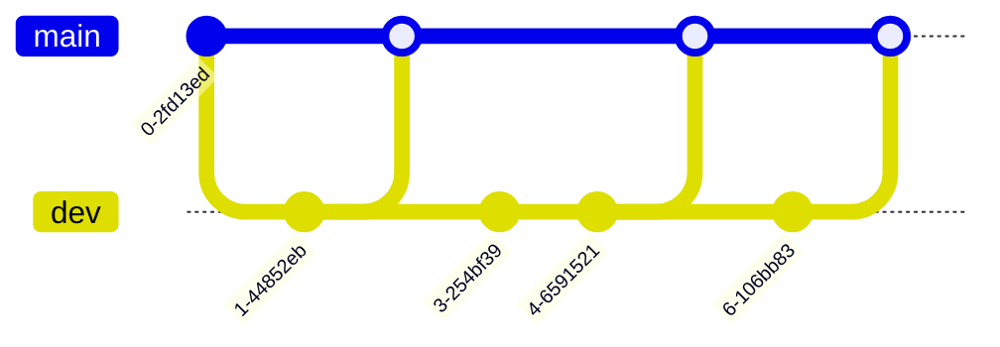
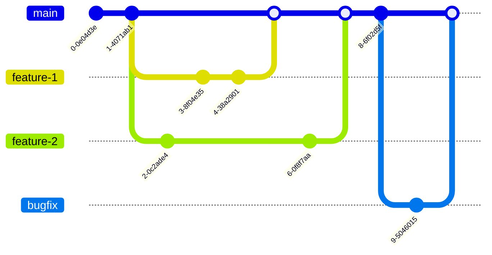
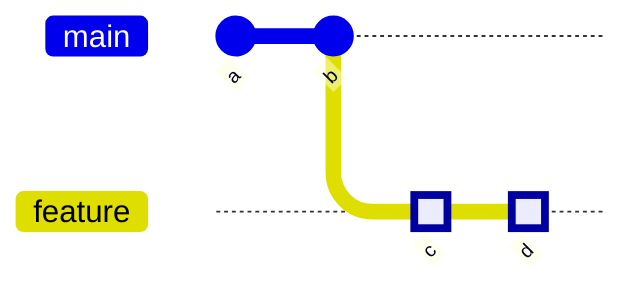
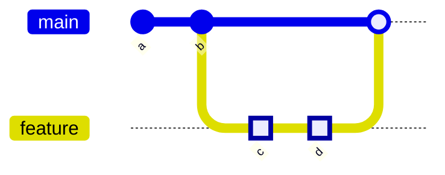
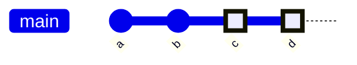
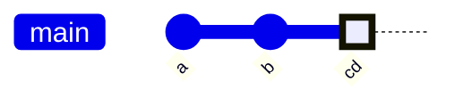
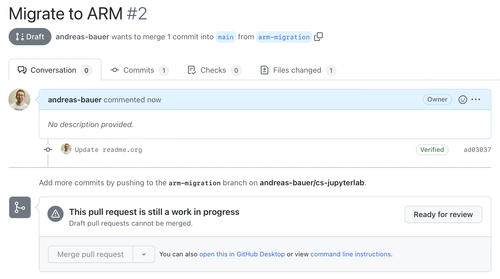
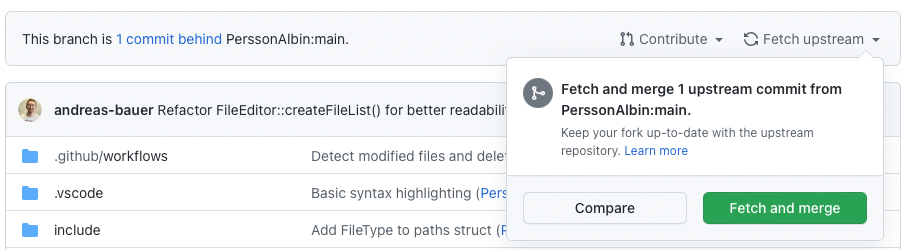

# Git 101

## Configuration (global and project scope)

### Global gitconfig

Configure non-default behavior once on a global scope to use it in all repositories.

Create the file `~/.gitconfig` or `~/.config/git/config`.

```shell
[user]
  email = andreas.bauer@bth.se
  name = Andreas Bauer
[core]
  autocrlf = input
  excludesfile = ~/.gitignore
```

This settings can also be set via the `git config` command:

```shell
git config --global user.name "Andreas Bauer"
git config --global user.email andreas.bauer@bth.se
```

[Example global gitconfig](https://github.com/andreas-bauer/dotfiles/blob/master/gitconfig)

For more information see the [official documentation](https://git-scm.com/book/en/v2/Customizing-Git-Git-Configuration).

### Repository gitconfig

Sometimes you want to use a different email addresses in different repositories,
e.g., one for work related repositories and one for private repositories.
You can change (override) global settings on a repository level by
using the `--local` parameter when setting git configs.

```shell
git config --local user.email myname@work.com
```

You can check your local configuration by displaying the config file in the repository:

```shell
cat .git/config
```

## Gitignore

### Global gitignore file

A global `.gitignore` file allows you to ignore files and directories in all
Git repositories.
This is especially useful when the OS creates files or directories that are not
related to the Git project at all,
like the `.DS_Store` files in macOS or `.Trash` folder in Linux.

Create a `~/.gitignore` file and reference it in the global config (see example above).

```gitignore
# KDE directory preferences
.directory

# Linux trash folder
.Trash-*<Paste>

# macOS DS_Store files
.DS_Store
```

[Example global gitignore file](https://github.com/andreas-bauer/dotfiles/blob/master/gitignore)

### Gitignore templates

If you are not sure what the `.gitignore` file for a specific language/technology
should contain you either can use a generator or existing templates.

- [gitignore-generator](https://mrkandreev.name/snippets/gitignore-generator/)
- [collection of .gitignore templates](https://github.com/github/gitignore)

## Commits

Git commits represent atomic changes of the codebase.
You can commit staged files to the repository using `git commit`.

If you want to add changes to a previous commit without creating a new commit
you can use the `--ammend` argument.
This is helpful if you want to fix a typo you missed in the previous commit.

With the argument `--verbose` all changes will be presented as a diff and
you will be able to write commit messages that consist of multiple lines.

```shell
# stage a specific file
git add README.md

# stage all files that are not ignored
git add *

# stage all files of a folder
git add src/

# create commit with a commit message
git commit -m "Add CI workflow"

# add changes to previous commit instead of creating a new commit
git commit --amend

# show the full diff of the changes before commting
git commit --verbose

```

## Commit size

Big changes are hard to understand and review by other developers.
Therefore, you should make multiple small commits instead of one big commit.
These commits should also follow the Single Responsibility Principle (SRP)
to further improve the understandability of changes.

Best practices in code reviews regarding the size of code changes [1]:

- "Keep code changes small."
- "Keep one Pull Request per concern."

Reference:

[1] Dong, L., Zhang, H., Yang, L., Weng, Z., Yang, X., Zhou, X., & Pan, Z. (2021).
Survey on Pains and Best Practices of Code Review.
2021 28th Asia-Pacific Software Engineering Conference (APSEC), 482–491. [https://doi.org/10.1109/APSEC53868.2021.00055](https://doi.org/10.1109/APSEC53868.2021.00055)

## Commit messages

Good commit messages helps other developers to understand the changes in your codebase.
Therefore, you should explain the what and the why of a change.
Additionally, commit messages should be consistent to improve the readability.

The commit message should be written in a way that it could
complete the following sentence:

*If applied, this commit will* `[commit message]`.

Example: *If applied, this commit will* `Add Docker setup for server`.

Some rules for good commit messages:

- Keep subject line short (50 chars)
- Consistent capitalization (preferred 'Refactor …' instead of 'refactor …')
- Imperative mood ('Add' instead of 'added')

If you want to incorporate more information in a commit message use
the following format:

```txt
Add Docker setup for server

* add Dockerfile
* add docker-compose file
* remove obsolete Makefile
```

or

```txt
Add Docker setup for server

The Docker setup will simplify the handling of the dev and prod environment.

```

If you are working with issues (GitHub, Jira, etc.),
you should reference the issue if the commit closes an issue.
This helps to trace issues through the development process
and gives the commit message more contextual information (why the change).

Example: `Add validation to email input field (closes issue #42)`

Good blog article with further information: [https://cbea.ms/git-commit/](https://cbea.ms/git-commit/).

## Undo changes

You can undo changes on tracked files that are not commited yet with `git restore`.

```shell
# restore all files in the current folder and its sub-folders
git restore .

# restore specific files
git restore README.md
git restore src/
git restore '*.js'

# unstage a staged file
git restore --staged README.md
```

To remove untracked files from the repository use `git clean`.

```shell
# remove all untracked files in the tracked directories
git clean -f

# remove also all files from untracked directories
git clean -d -f
```

## Fix ups (rebase)

A clean Git commit history helps to better understand the changes on the codebase.
Commits that only fix other commits bloating the commit history.
Typical examples are typo or code style fixes.

```shell
# BAD: The Git history is cluttered with commits that fix previous commits
# git commit history (git log)
# * 8d3f6c2 (HEAD -> main) Change title
# * 632d1a5 Fix linter issues for introduction section
# * 9a1a989 Fix typos in introduction section
# * adfe739 Add license section
# * f37396e Add introduction section
```

To maintain a clean Git commit history, you should mark fix commits with the
`--fixup` argument and rebase the branch.
Whereas fixup expects a reference (hash) to a previous commit.

```shell
# create a fixup for commit f37396e
git commit --fixup f37396e

# git commit history (git log)
# * 8d3f6c2 (HEAD -> main) Change title
# * 632d1a5 Fixup! add introduction section
# * 9a1a989 Fixup! add introduction section
# * adfe739 Add license section
# * f37396e Add introduction section

# rebase last 4 commits
git rebase --autosquash --interactive HEAD~4

# Rebase resulted in a clean commit history
# git commit history (git log)
# * 8d3f6c2 (HEAD -> main) Change title
# * adfe739 Add license section
# * f37396e Add introduction section
```

❗️Don't rebase already pushed commits.

## Aliases

Make you life easier by creating aliases for often used Git commands.

```bash
alias gs='git status'
alias ga='git add '
alias gb='git branch '
alias gc='git commit --verbose'
alias gd='git diff'
alias gco='git checkout '
alias gl='git log --graph --decorate --pretty=oneline --abbrev-commit'
alias gr='git restore '
```

Add Linux aliases to your shell configuration:

- Bash shell: `~/.bashrc`
- Zsh shell: `~/.zshrc`
- Fish shell: `~/.config/fish/config.fish`

[My git aliases](https://github.com/andreas-bauer/dotfiles/blob/1140290787b326b5b685cc68ee63955d4f633de4/zsh/aliases.zsh#L50)

Git itself has a build-in support for aliases.

```shell
# configuration
git config --global alias.co checkout

# usage
git co
```

For more information about aliases in Git see the [official documentation](https://git-scm.com/book/en/v2/Git-Basics-Git-Aliases).

## Workflows with GitHub

### Working in branches

Git enables complex branching models as demonstrated [here](./assets/Git-branching-model.pdf),
but you shouldn't introduce a complex branching model in your project if not necessary.

A simple branching strategy based on `dev` and `feature` branches is sufficient
in most cases.

In a `dev` (development) branch …



*With a feature branch workflow* all development happens in
dedicated branches instead of the `main` branch.



Feature branches should …

- have a clear focus or purpose (single-responsibility principle)
- be small
- have a short lifetime
- be tested before merged into the `main` branch
- be merged via a pull requests

This allows a collaborative workflow based on pull requests with code reviews.

### Pull requests / merge requests

Github allows three different types to merge pull requests
that impact the Git history in different ways.

- Merge commit
- Rebase and merge
- Squash and merge

To demonstrate the differences in merge outcome we will use the following setup:
A feature branch with multiple commits shall be merged into the main branch.



#### Merge commit

The feature branch and its commits will be joined together with the main branch.

- Github's default merge strategy
- Git commit history is not as streamlined as with other merging strategies
- uncomplicated roll back of features
- default commit message “Merge pull request” is not helpful to understand changes



#### Rebase and merge

All commits of the feature branch will be added to the
main branch individually without a merge commit.

- rewrites Git commit history
- maintains a linear commit history
- force-push is sometimes required due to the rewrite of the commit history
- force-push on public repositories is not recommended
- most flexible solution



#### Squash and merge

All commits of the feature branch will be squashed into a
single commit that will be added to the main branch.

- maintains a linear commit history
- uncomplicated roll back of features
- losing detailed commits in commit history
- fine for small changes, but problematic for long-running branches



### WIP (Draft) pull requests

You can use a draft pull request to start an early discussion about a feature
that is work-in-progress (WIP).
Draft pull requests cannot be merged.

When creating a pull request, select `Create draft pull request` (see screenshot).


After the author removes the draft status of the pull request, merging becomes possible.



In Gitlab, the prefix `WIP:` marks merge requests (pull requests) as work-in-progress.

### Keep a fork up-to-date

If you work on a repository fork, you need to fetch and merge upstream changes
to keep your fork up-to-date with the repository you forked from.

You can use GitHub's UI (see screenshot), or Git commands (see code snippet)
to fetch and merge changes from the upstream repository.



```shell
# add fork as remote with the name "upstream"
git remote add upstream https://github.com/andreas-bauer/git-101.git

# to check all remote targets
git remote -v

# fetch changes from remote
git fetch upstream

# merge changes of a remote branch into the current branch
git merge upstream/main

```

## License

Copyright © 2022 Andreas Bauer

This work is licensed under [CC BY-SA 4.0](./LICENSE).
